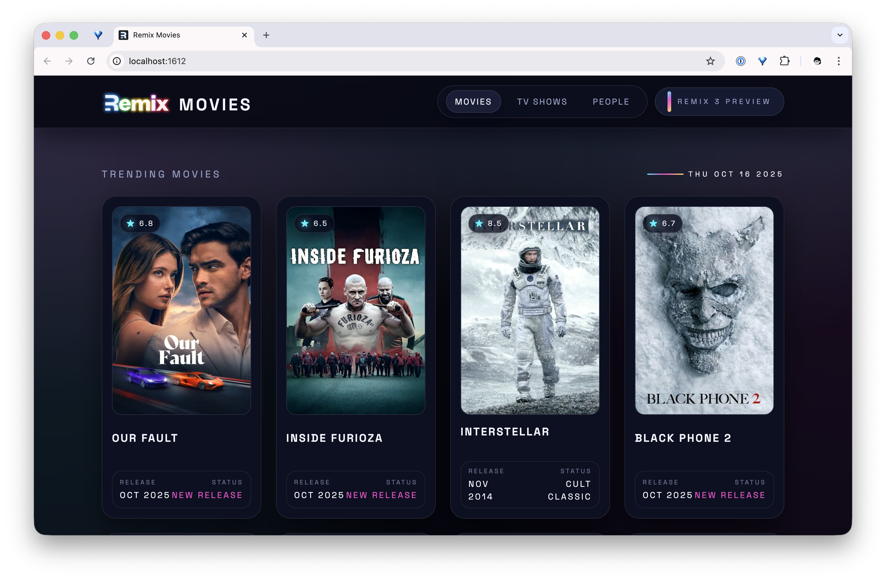
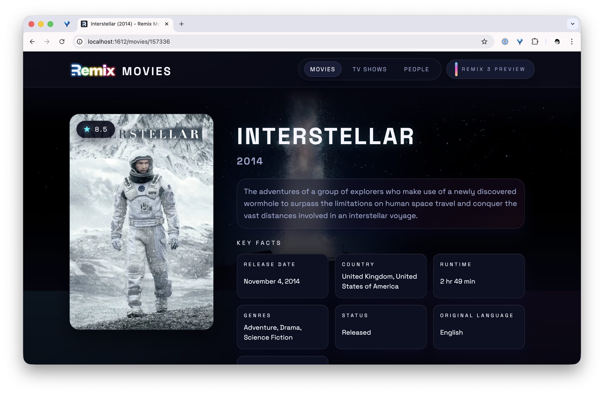

# Remix Movies

This is a demo of the [Remix 3 preview](https://github.com/remix-run/remix), recreating the [Taste.js Movies](https://tastejs.com/movies) application using Vite and the [Nitro 3 alpha](https://v3.nitro.build). It works well in development mode, but I haven't been able to figure out deployment with Nitro 3 yet.

This project required a [TMDb API key](https://developer.themoviedb.org/docs/getting-started) to be placed in your `.env` file:

```sh
TMDB_API_KEY="abc123"
```

To start the development server, [install Mise](https://mise.jdx.dev/installing-mise.html) and run:

```sh
mise install
mise run dev
```



